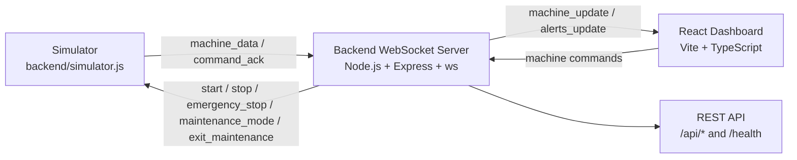

# Smart Factory Dashboard

A real-time smart factory monitoring and control dashboard built with React, TypeScript, Tailwind CSS, Node.js, Express, and WebSockets. It uses a simulator to model factory machines, telemetry, commands, alerts, production jobs, and maintenance scheduling.

## Highlights

- Command Center overview
- Machines page with search/filter/sort
- Machine detail page with live telemetry charts and control panel
- Start/Stop/E-stop/Maintenance/Exit Maintenance controls
- Simulator command acknowledgements
- Production board with job health based on machine status
- Maintenance dashboard with due-date and priority filtering
- Analytics dashboard
- Alert center with active/resolved acknowledgement workflow
- Stable deterministic demo data for production and maintenance
- WebSocket-based real-time updates

## Architecture



The simulator publishes machine telemetry to the backend WebSocket server. The backend stores the latest live state, emits updates to connected dashboards, forwards dashboard commands to the simulator, and exposes REST endpoints for machine, alert, command, and health access.

## Tech Stack

### Frontend

- React
- TypeScript
- Vite
- Tailwind CSS
- Recharts
- Heroicons

### Backend

- Node.js
- Express
- `ws` WebSocket library
- CORS

## Project Structure

```text
smart-factory-dashboard/
├── frontend/   # React TypeScript dashboard
├── backend/    # Express server, WebSocket bridge, and simulator
├── docs/       # Project documentation
└── scripts/    # Development startup scripts
```

## Getting Started

### Prerequisites

- Node.js
- npm
- Git

### Install

```bash
cd backend
npm install

cd ../frontend
npm install
```

### Run

Start the backend, simulator, and frontend in three separate terminals.

Terminal 1: backend

```bash
cd backend
npm run dev
```

Terminal 2: simulator

```bash
cd backend
npm run sim
```

Terminal 3: frontend

```bash
cd frontend
npm run dev
```

Open:

```text
http://localhost:5173
```

## Available Scripts

### Backend

- `npm run dev` - start the backend with `nodemon`
- `npm run sim` - start the machine simulator

### Frontend

- `npm run dev` - start the Vite development server
- `npm run lint` - run ESLint
- `npm run build` - build the production frontend bundle

## Demo Flow

1. Open Overview.
2. Open Machines.
3. Select a machine.
4. Stop the machine and observe zeroed activity and paused charts.
5. Start the machine.
6. Enter Maintenance Mode and Exit Maintenance.
7. Trigger Emergency Stop and Reset.
8. Visit the Production, Maintenance, Analytics, and Alerts pages.

## Supported Commands

- `start`
- `stop`
- `emergency_stop`
- `reset_emergency`
- `maintenance_mode`
- `exit_maintenance`

## API and WebSocket Overview

### REST

- `GET /api/machines`
- `GET /api/alerts`
- `POST /api/machine/:id/command`
- `GET /health`

### WebSocket

- Simulator connects to `ws://localhost:3001`
- Dashboard connects to `/dashboard`
- `machine_data`
- `machine_update`
- `command_ack`
- `alerts_update`

## Simulation Notes

Machine telemetry is simulated for demo and development. Running machines generate live telemetry for output, efficiency, temperature, vibration, and power consumption. Idle, maintenance, and emergency states intentionally show zero activity for clear demo behavior. Production and maintenance data are deterministic and stable so demos are repeatable.

## Future Improvements

- Database persistence
- Authentication and roles
- Real hardware adapter
- Historical analytics storage
- Notifications
- Deployment and Dockerization
